# Captures
*  `libero.pcapng`:
This capture was made by browsing to [https://login.libero.it/](https://login.libero.it/)
*  `vulnweb.pcapng`:
This capture was made by browsing to [http://testphp.vulnweb.com](http://testphp.vulnweb.com)

# Objective
Configure Wireshark to display records associated with HTTPS traffic.

# HTTP vs HTTPS
Both HTTP and HTTPS searches generate HTTP/HTTP2/HTTP3 records in Wireshark. For HTTP traffic, these records are always displayed by Wireshark. However, for HTTPS traffic, these records are hidden by default.

Let’s look at the `vulnweb.pcapng` extract, which was made using an HTTP search:

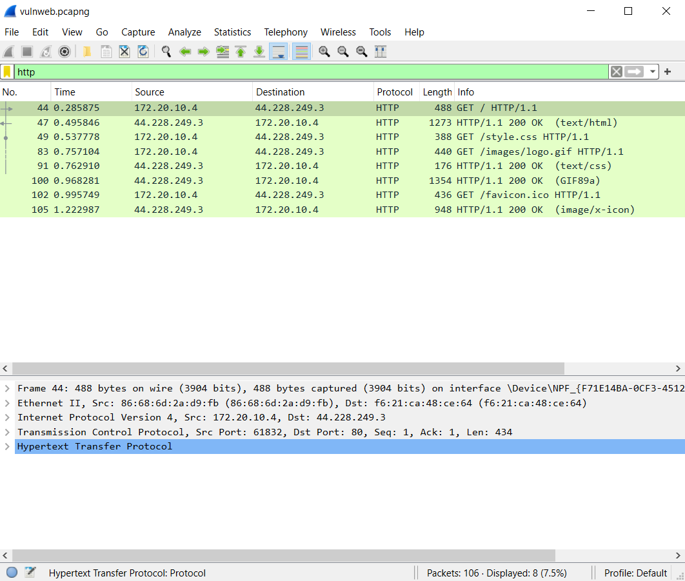
Filtering by the HTTP protocol, we can see that there are 8 records.

Now, consider the `libero.pcapng` extract, which was made using an HTTPS search. Applying a display filter for the HTTP protocol does not display any records:

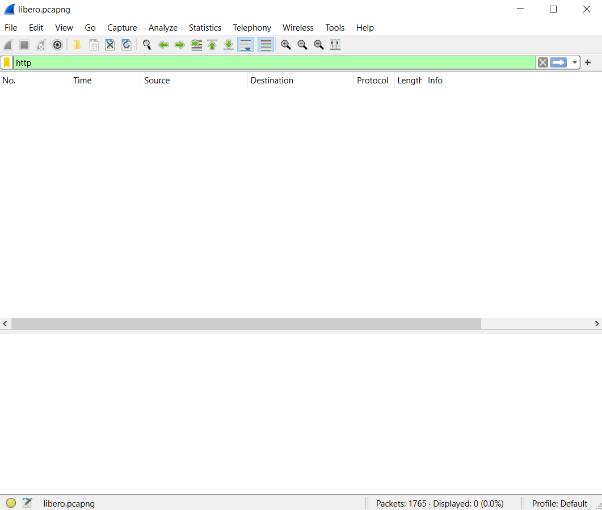

# HTTPS Decrypting

To decrypt HTTPS traffic, Wireshark needs access to the TLS key. First, we need to create an environment variable so that the key is written locally on our PC instead of being stored in the browser by default.

To do this, search for 'Environment Variables' in the search bar:

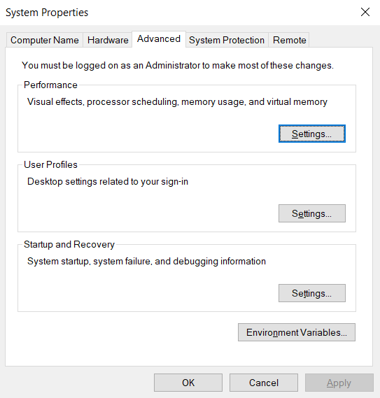
Select 'Environment Variables':

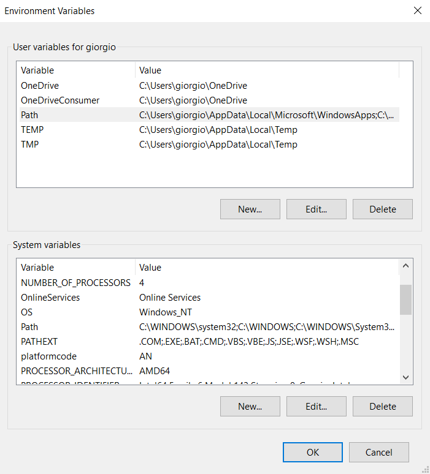
Click 'New' under 'System Variables'. Fill in the 'Variable' field with the path of the directory where you want the TLS key to be written.

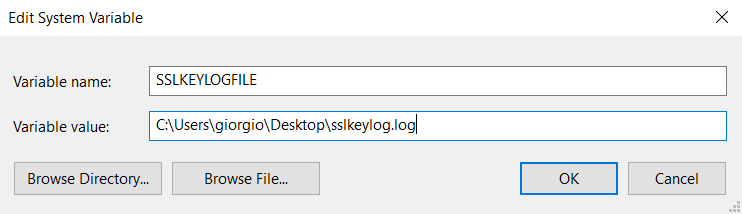

**Warning**: The file sslkeylog.log should not be created beforehand.

Now, restart your computer. After rebooting, perform any search in your browser. If everything works correctly, the file should automatically be created in the directory specified and should look something like this:

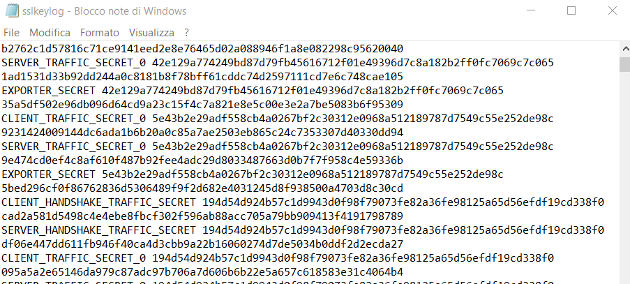
Now that we have the key stored locally, we can configure Wireshark to read it from there. Go to Edit > Preferences:

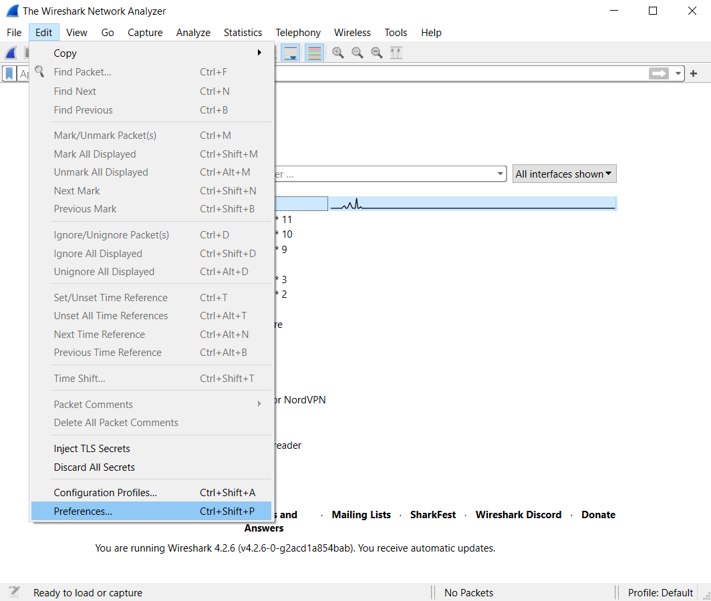
Navigate to Protocols > TLS:

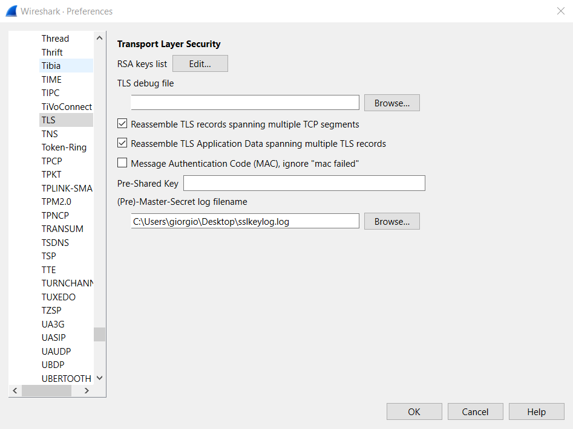
Enter the same path as the environment variable for the Pre-Master Secret.

# Test
Return to the `libero.pcapng`, extract and reapply the display filter for the HTTP protocol. You should now see that records are displayed:

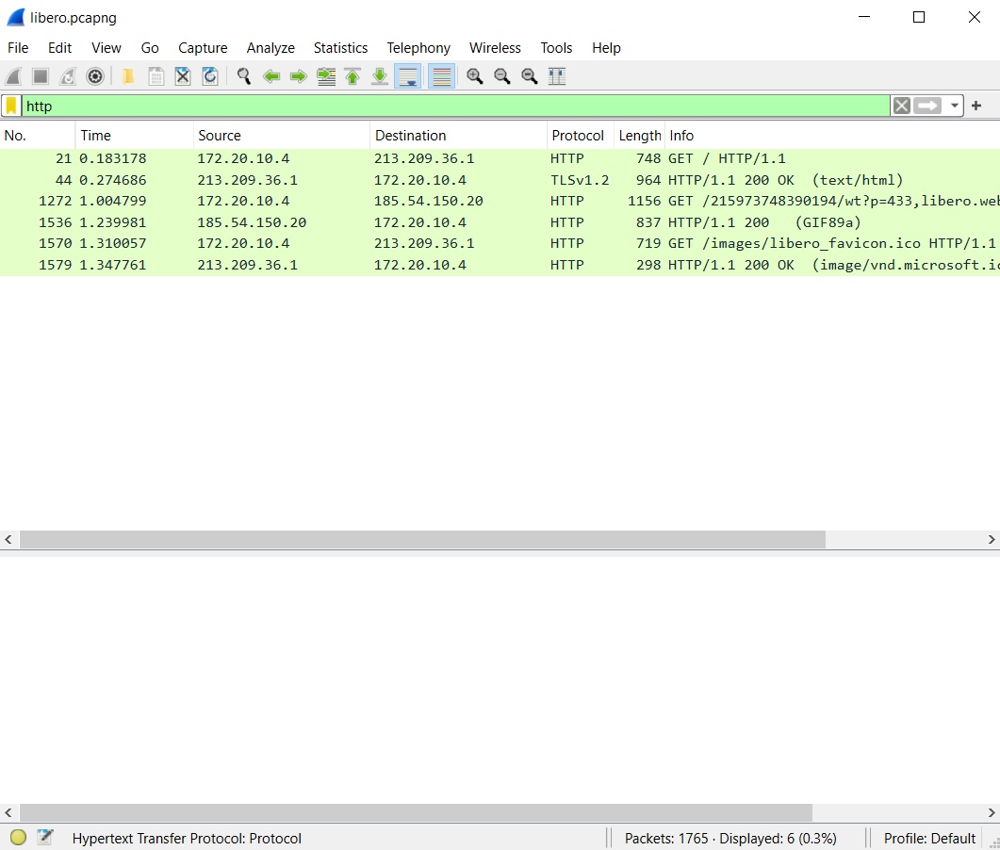

**Warning**: These records were always present in the capture; Wireshark just wasn't showing them. This means that you can decrypt HTTPS traffic even after the capture has been made by adding the PMS.

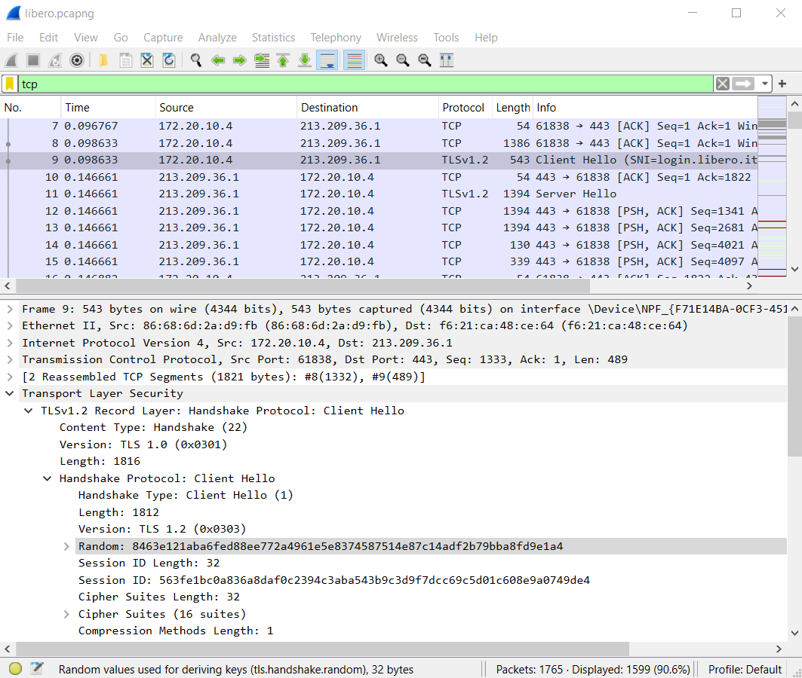

As discussed, Wireshark can decrypt HTTPS when it has the TLS key. This key can be found in the first record of the TLS handshake (in this case, it’s record 9):

In the packet details, the key is located in the section TLS > TLSv1.3 > Handshake > Random. The same key should be found in the `sslkeylog.log`:

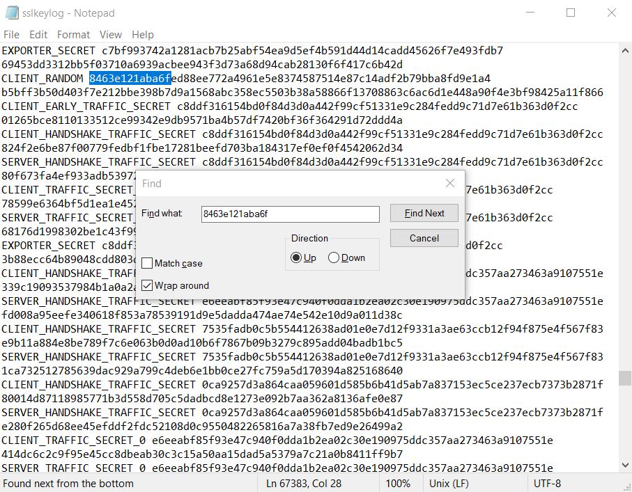