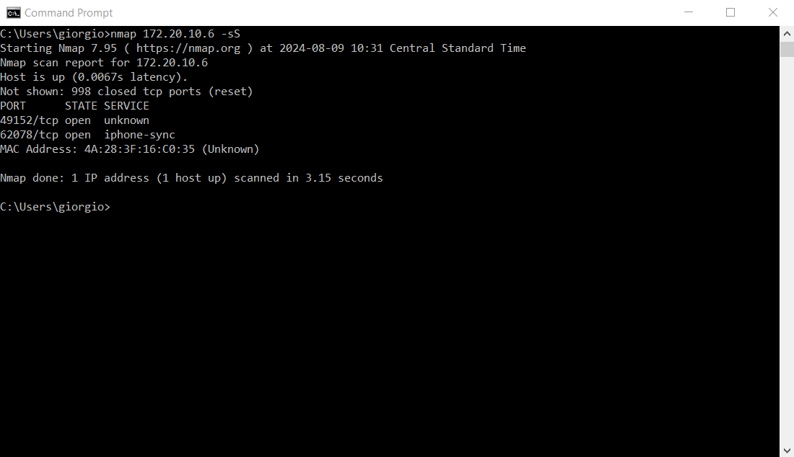
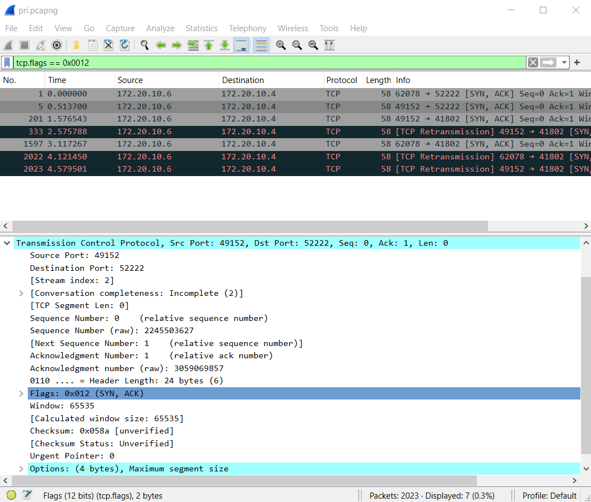
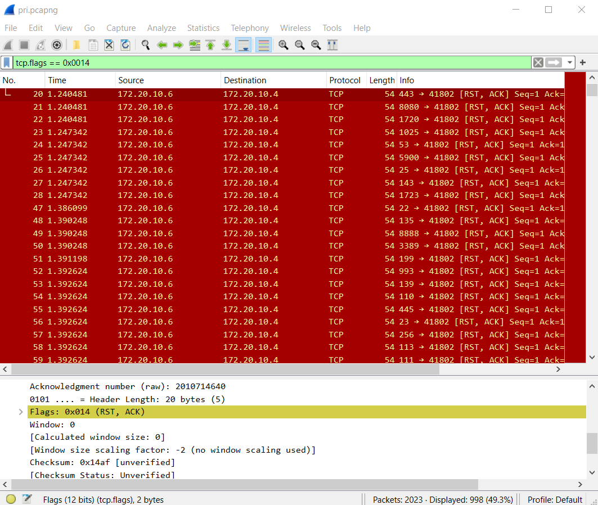
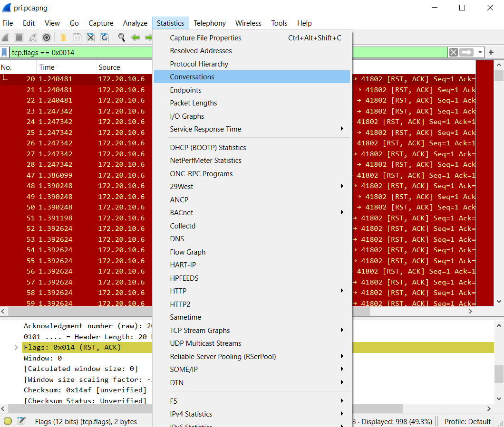
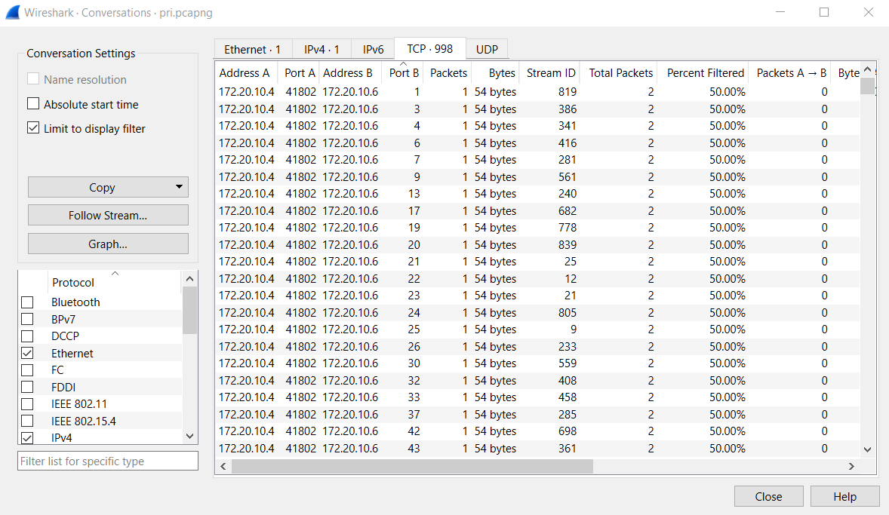
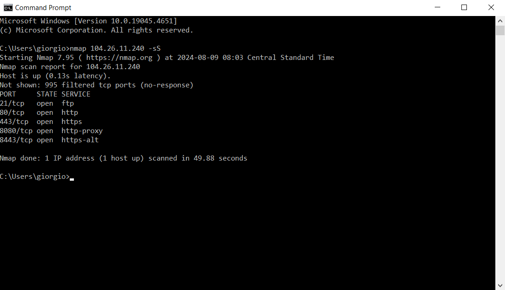
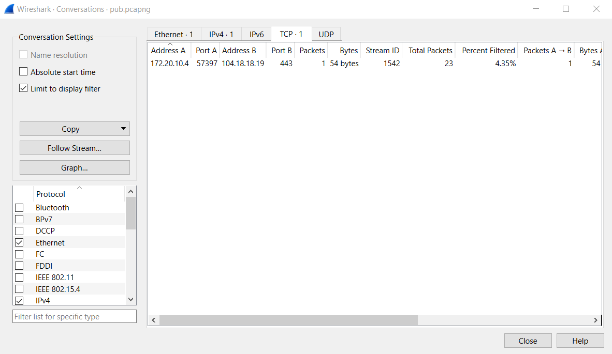
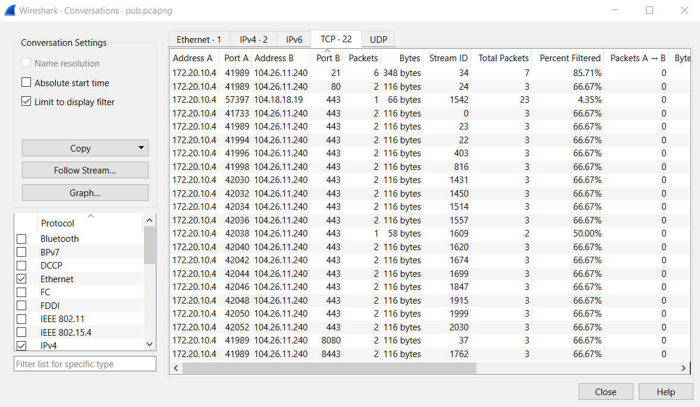

# Captures

*  `pri.pcapng`:
  ```sh
  nmap 172.20.10.6 -sS
  ``` 
*  `pub.pcapng`:
  ```sh
  nmap 104.26.11.240 -sS
  ```

# Objective

To compare the results of an Nmap scan with Wireshark captures. In this case, we conducted a SYN scan (-sS) to detect open TCP ports. With Wireshark, we should be able to identify the same open ports reported by Nmap and also the ones marked as "reset".

# Case 1

We performed a scan on a device within our local network:


Nmap identified 2 open ports (49152 and 62078) and 998 reset ports (without specifying which ones).

Let’s compare the scan results with those in the `pri.pcapng` capture.

To locate the open ports, apply a display filter that selects only TCP SYN-ACK records:


You can see that the open ports are exactly those two.

To locate the reset ports, apply a display filter that selects only TCP RST-ACK records:


Next, go to the Conversations section:


Select the TCP type:


Here, you’ll find 998 reset ports as in the Nmap scan. Additionally, Wireshark shows you which ports these are (column B).

# Case 2

We performed a scan on a public IP (corresponding to the URL `https://wireshark.org/`):



Nmap identified 5 open ports and 995 no-responses.

Let’s compare the scan results with those in the `pub.pcapng` capture.

**Warning**: The method used earlier helps us find "reset" ports, not "no-response" ports. Indeed, we don't find 995 TCP conversations by filtering for RST-ACK:


However, the open ports can be identified as in Case 1 by filtering for SYN-ACK:


In column B, you can see the 5 open ports detected by Nmap.