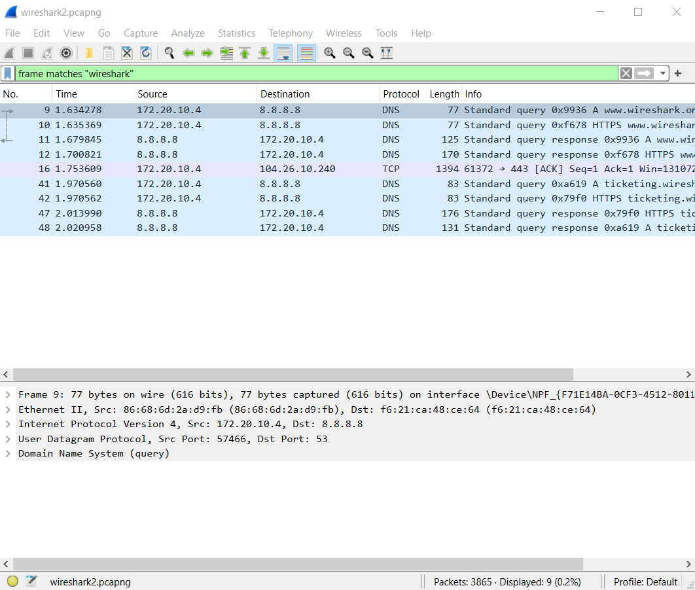
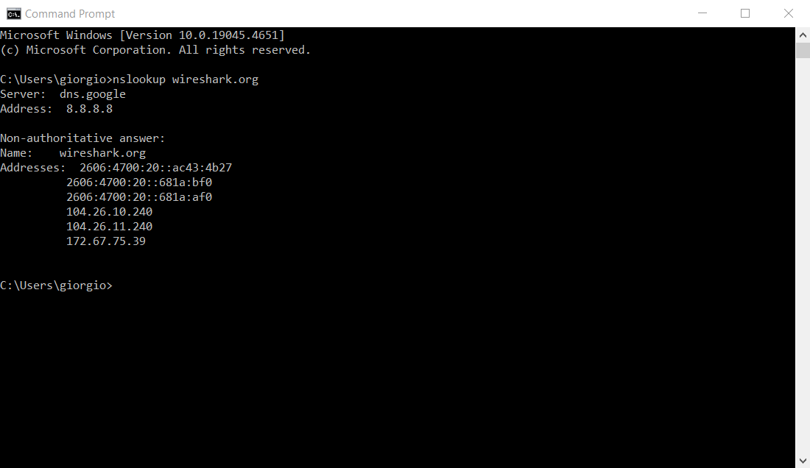
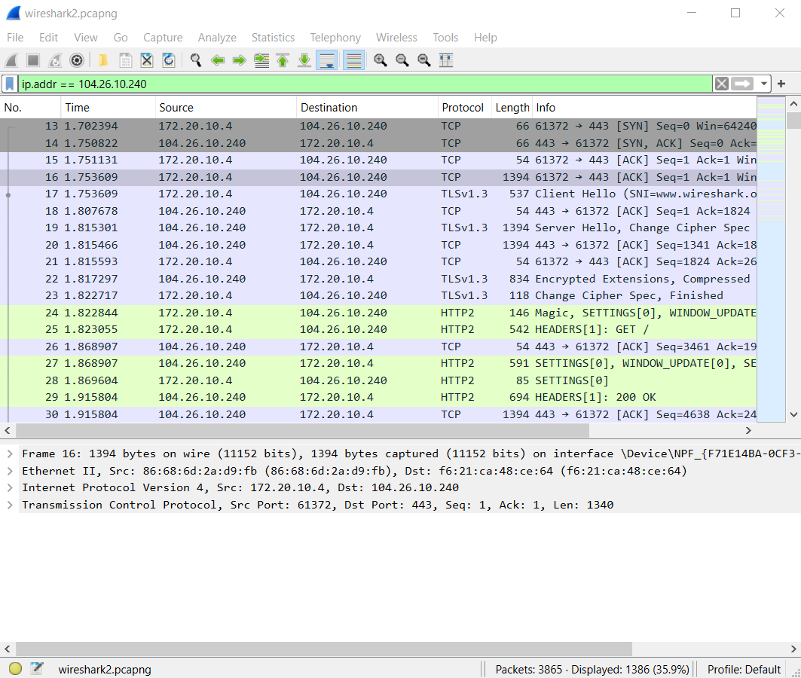
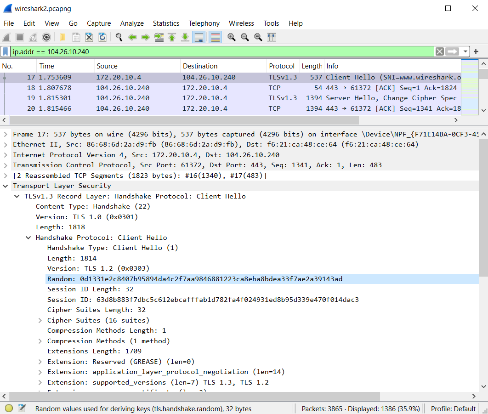
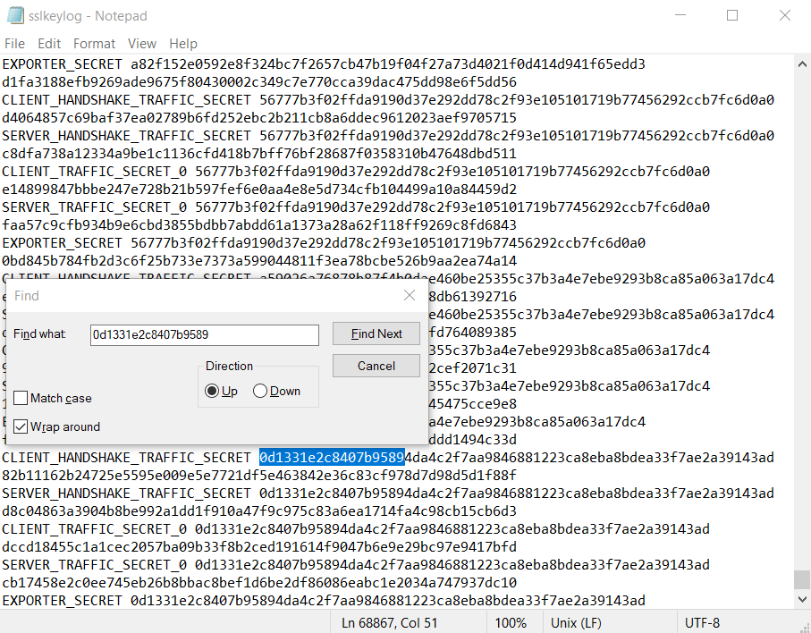

# Captures
*  `wireshark2.pcapng`:
Performed a search in the browser at [https://wireshark.org](https://wireshark.org)

# Objective
Extract and analyze records from Wireshark that pertain to the TCP handshake and TLS handshake.

# Finding the IP

The first step is to identify the IP address associated with the URL you searched for. Apply a display filter that selects records containing the domain of the URL:

You can find the IP address in record 16.

**Warning**: It’s preferable to find the IP this way rather than using nslookup, as the results may not always match:

In this case, nslookup returns two IP addresses, but only one of them is correct.

# TCP Handshake

Now, apply a display filter that selects records with the IP address you found (as either source or destination):

The first three records correspond to the three steps of the TCP handshake:
*1. record 13: SYN (ip.dst)
*2. record 14: SYN-ACK (ip.src)
*3. record 15: ACK (ip.dst)

**Warning**: Wireshark sometimes produces duplicate records. In this case, you can see that record 16 is a duplicate of record 15 and does not correspond to another step in the TCP handshake.

# TLS Handshake

Keep the same display filter applied. The first record after the TCP handshake is the first step of the TLS handshake (record 17). This record is a Client Hello.

This record is particularly interesting because it contains the random key, found under the path: TLS > TLSv1.3 > Handshake > Random.

This random key is the same as the one found in the sslkeylog:

