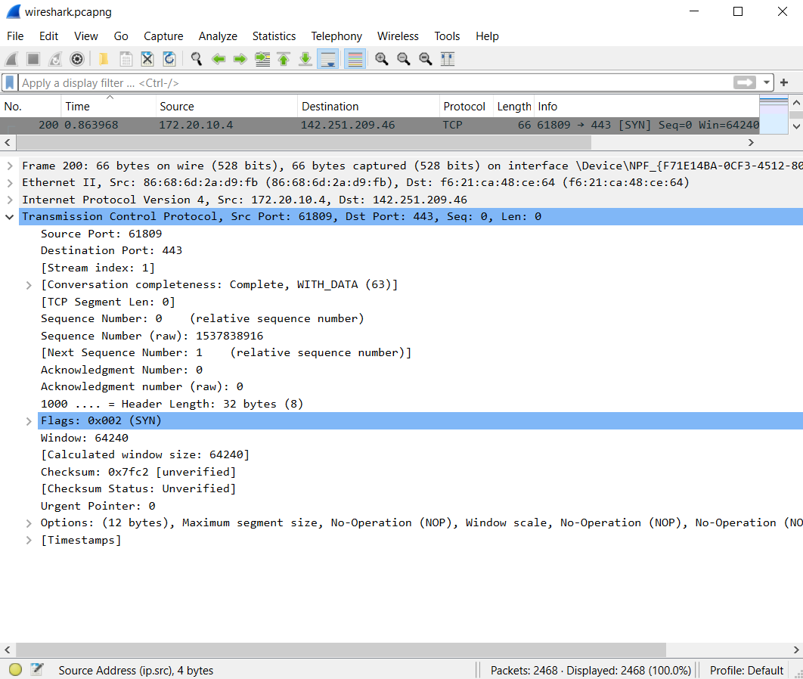
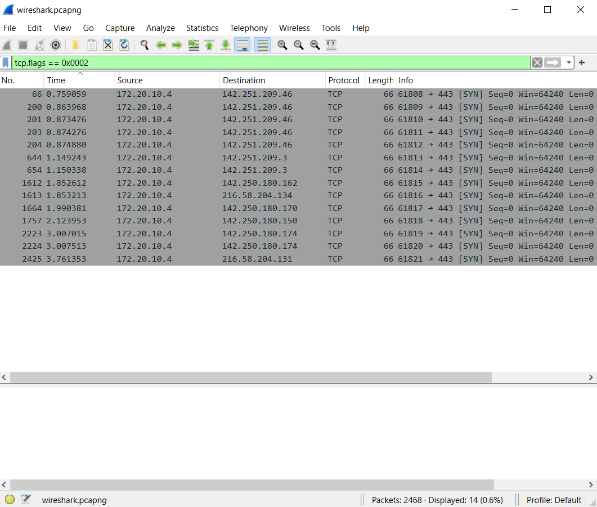
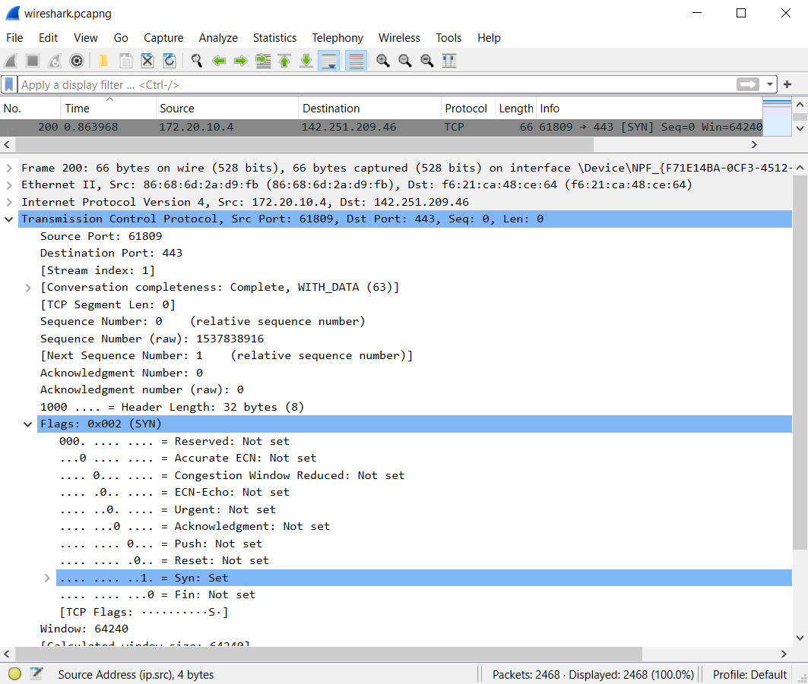
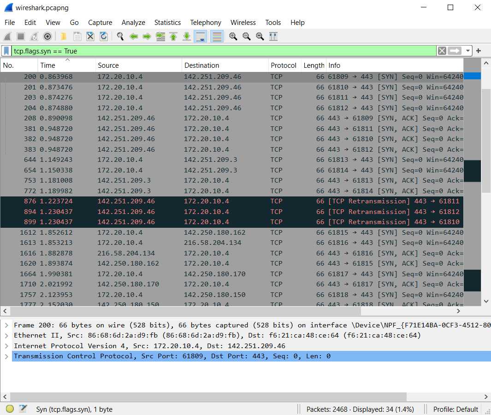
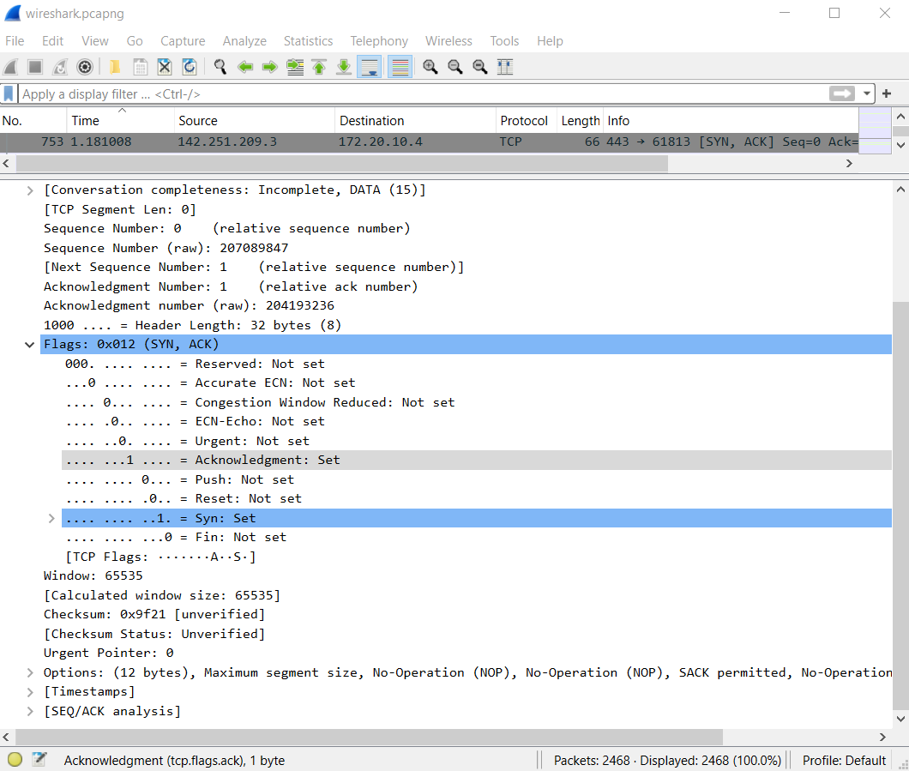
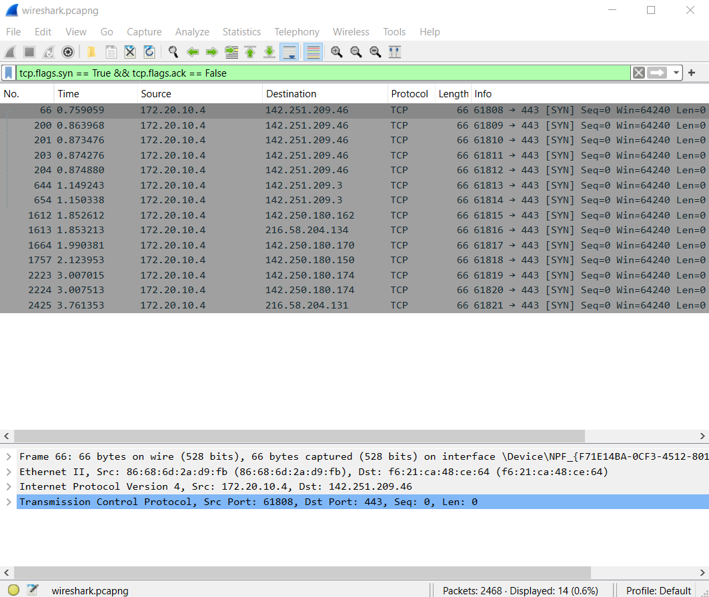

# Captures
*  `wireshark.pcapng`:
Performed a search in the browser at [https://wireshark.org](https://wireshark.org)

# Objective
Understand the different ways to filter TCP records in Wireshark.

# Method 1

Consider a TCP SYN record, such as record 200. By examining the packet details, you can see that the SYN flag is encoded as `0x0002` within the `TCP > Flags` section:

When you apply a display filter using this hexadecimal value, Wireshark will display all TCP SYN records:

This method is useful for quickly isolating specific types of TCP packets by their flag values.

# Method 2

You can also expand the Flags section to see all possible TCP flags listed, each set to 0 or 1. For instance, since record 200 is a SYN record, only the SYN flag is set to 1, while the others are set to 0:

Applying a display filter directly using the entries within this expanded section will filter out records based on the specific flag:

However, notice that this filter captures both SYN and SYN-ACK packets. This is because both types of packets have the SYN flag set to 1. For example, look at record 753:

To filter only SYN records and exclude SYN-ACK records, you need to specify that the ACK flag is set to 0:

This refined filter will now display only the SYN records, excluding SYN-ACK records.