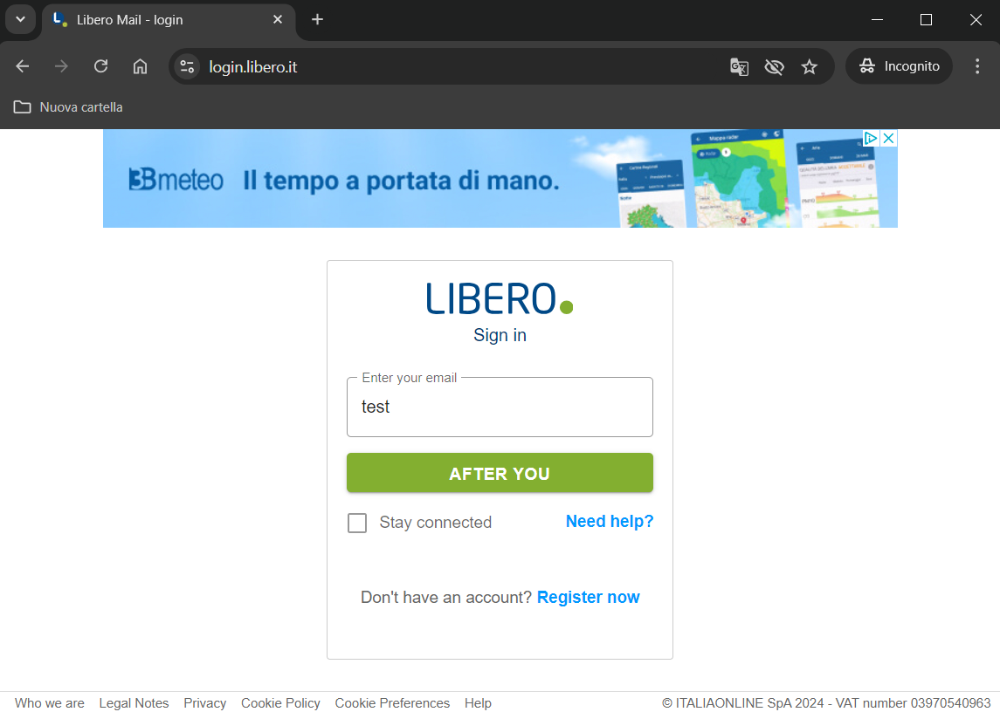
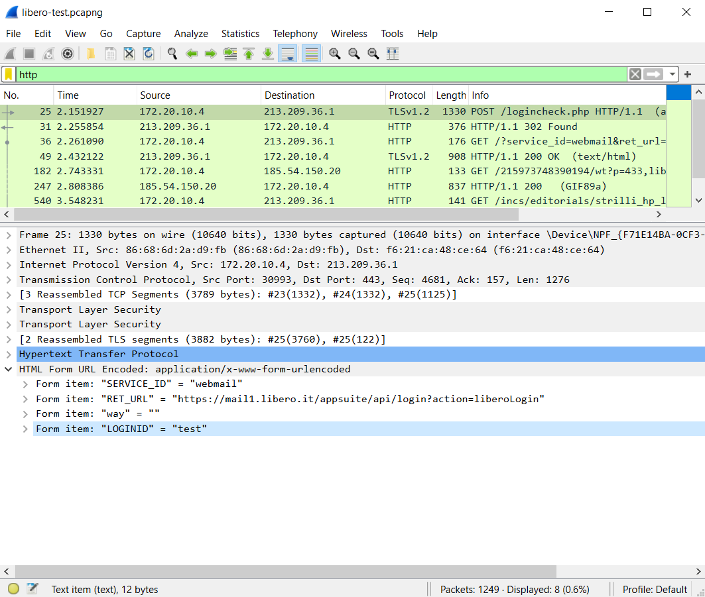
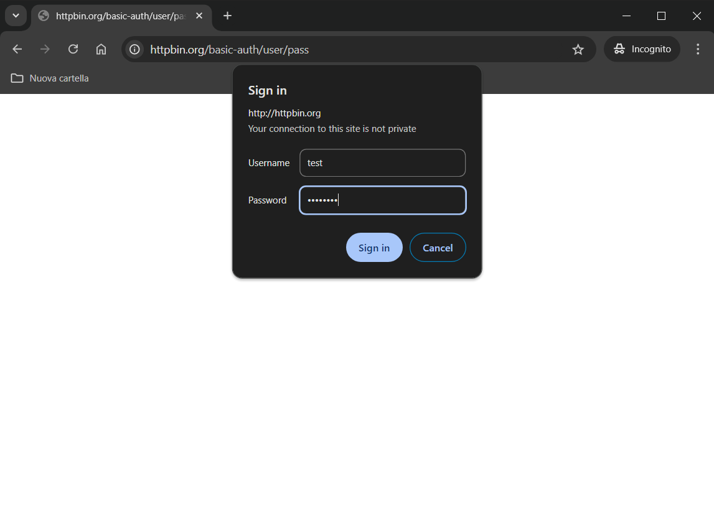
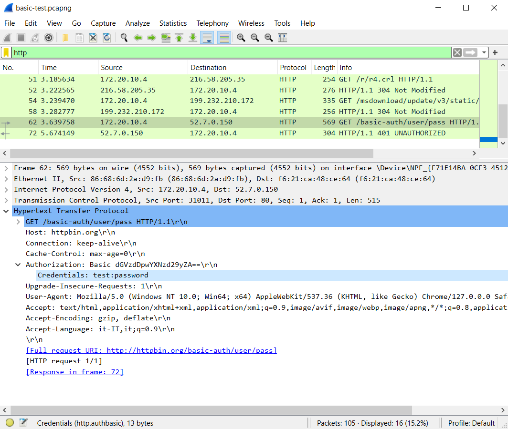

# Captures
*  `libero-test.pcapng`:
Form submission with the input `test` at [https://login.libero.it/](https://login.libero.it/)
*  `basic-test.pcapng`:
Form submission with the input `test:password` at [http://httpbin.org/basic-auth/user/pass/](http://httpbin.org/basic-auth/user/pass)

# Objective
To extract and read the credentials entered into an online form using Wireshark. Depending on the type of website, the approach differs, so here we present two different scenarios.

# Case 1
We submitted the form at [https://login.libero.it/](https://login.libero.it/):

Let's analyze this request using the `libero-test.pcapng` capture. Apply a display filter to select only the HTTP protocol.

**Warning**: This is an HTTPS request, so you need to configure Wireshark to decrypt TLS. If this isn’t done, Wireshark will not display any HTTP records. You can see how to configure Wireshark
[here](https://github.com/log-lady-og/wireshark/tree/main/HTTPS%20decryption)

In this case, we have a record with an HTTP POST request (record 25). By examining the packets in this record, you can find the credentials you entered under the "HTML" section.

# Case 2

We submitted the form at [http://httpbin.org/basic-auth/user/pass/](http://httpbin.org/basic-auth/user/pass):

Let's analyze this request using the `basic-test.pcapng` capture. Apply a display filter to select only the HTTP protocol.

**Warning**: This is an HTTP request, so there’s no need to configure Wireshark for TLS decryption.

In this case, we have a record with an HTTP GET request (record 62). By examining the packets in this record, you can find the credentials you entered under the "HTTP > Authorization" section.