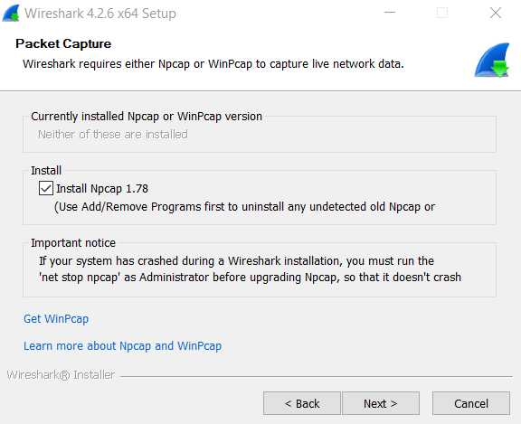
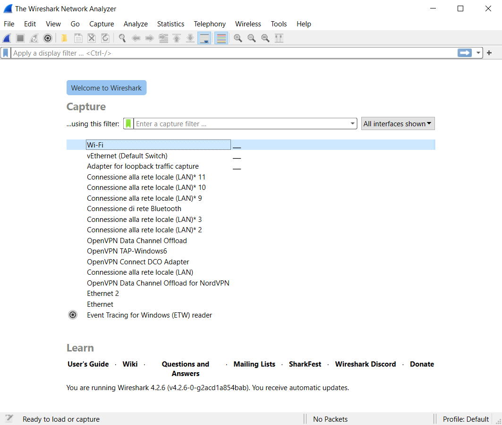
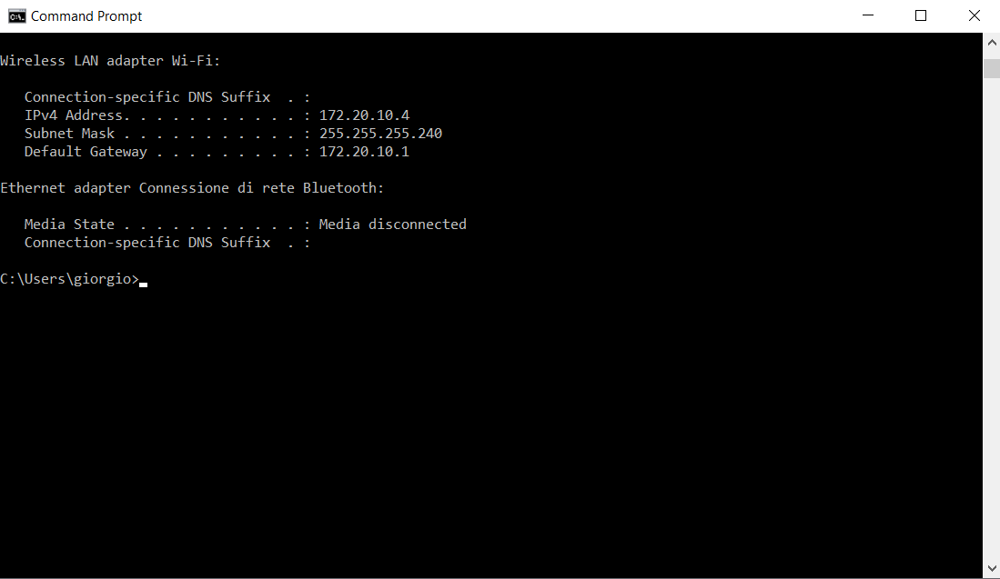
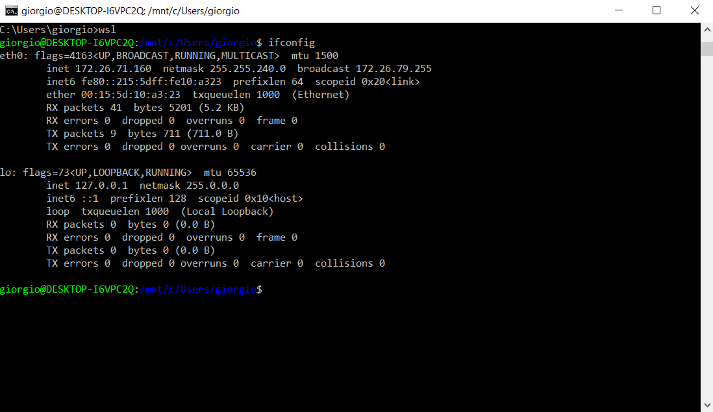

# Objective
Successfully install Wireshark on Windows 10.
This guide focuses on scenarios where Wireshark was previously installed (correctly or otherwise) and discusses potential bugs that may arise during reinstallation.

# Initial Steps
To ensure a successful installation, several actions must be taken before beginning:
* Uninstall Wireshark: If Wireshark was previously installed, uninstall it from the Control Panel. Then, make sure it's removed from the `C:\Program Files\Wireshark` directory; if not, delete it manually.
* Uninstall Npcap: If Npcap was previously installed, uninstall it from the Control Panel. Then, ensure it’s removed from the `C:\Program Files\Npcap` directory; if not, delete it manually. Npcap is used by various tools, not just Wireshark, so it might be on your computer even if you’ve never installed Wireshark.
* Remove Wireshark System Preferences: If Wireshark was previously installed, simply uninstalling it won’t remove it completely. You’ll also need to delete its preferences from the `C:\Users\giorgio\AppData\Roaming\Wireshark` directory.
* Uninstall Wireshark from WSL: If Wireshark was installed on a VM like WSL, it must be uninstalled from there as well. To do this, run the following commands:
  ```sh
  dpkg --list
  sudo apt purge wireshark
  ```

# Installation
Now we can proceed with the installation. Go to [https://www.wireshark.org/download.html](https://www.wireshark.org/download.html) and select the Windows x64 installer.

Since Npcap was uninstalled, you should be able to select the following option:


This allows you to download the latest version of Npcap.

Once the installation is complete, this is the main screen you will see:


Having removed the system preferences, there should be no saved searches when you type in the Capture Filters bar.

The network interfaces listed below the search bar should match those on your computer. You can verify this by running the following command in CMD:
  ```sh
  ipconfig
  ```



Notice that the network interfaces for WSL do not appear, which is expected. In my case, they are:


