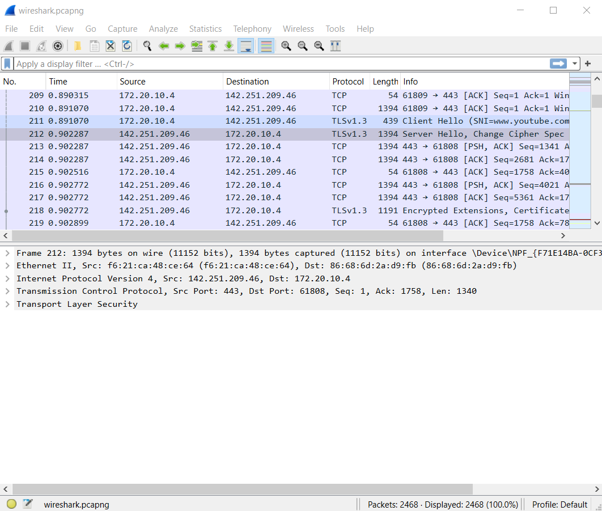
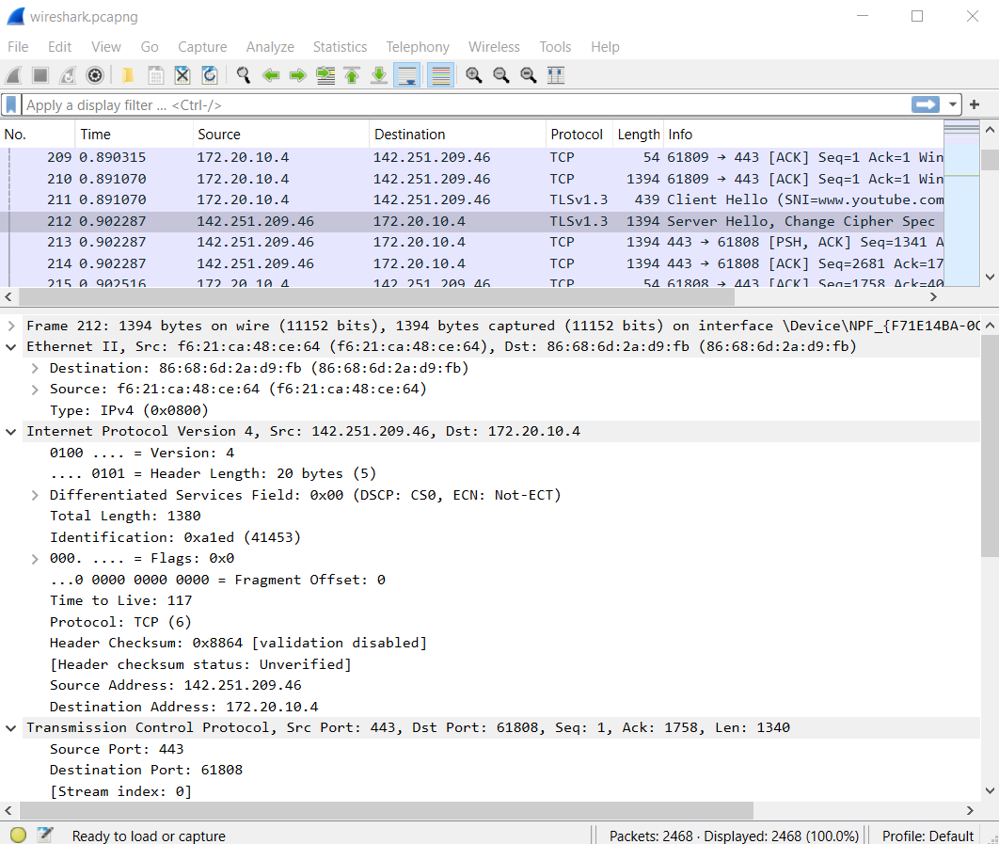
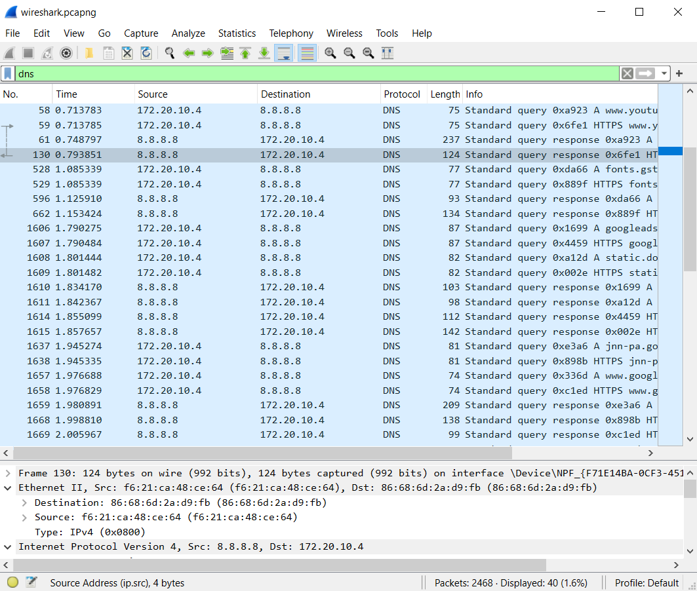
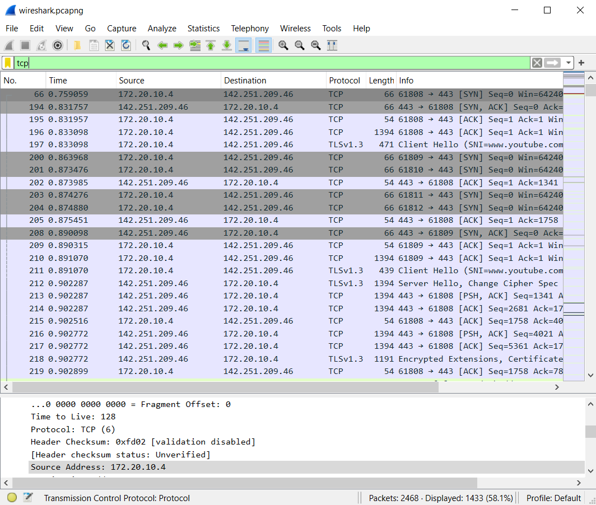
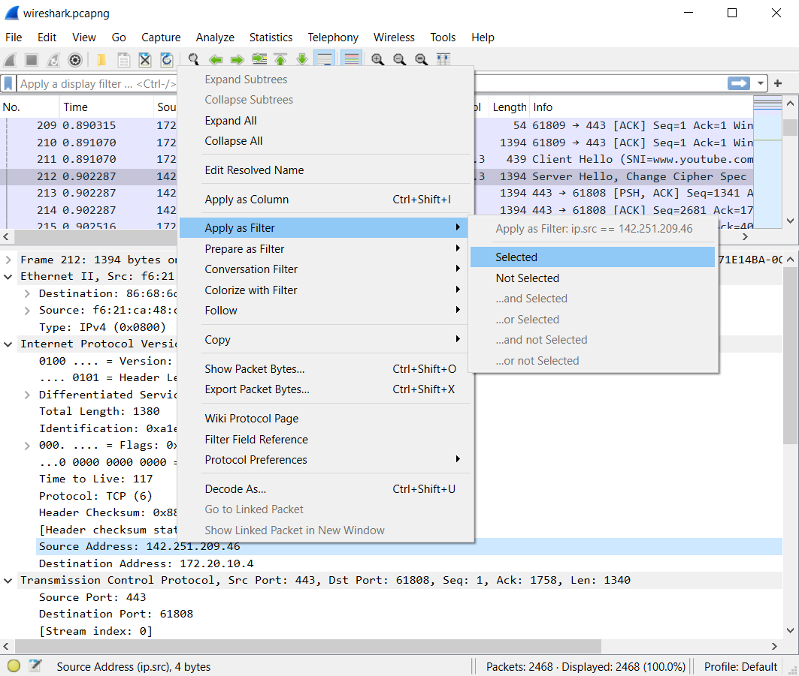
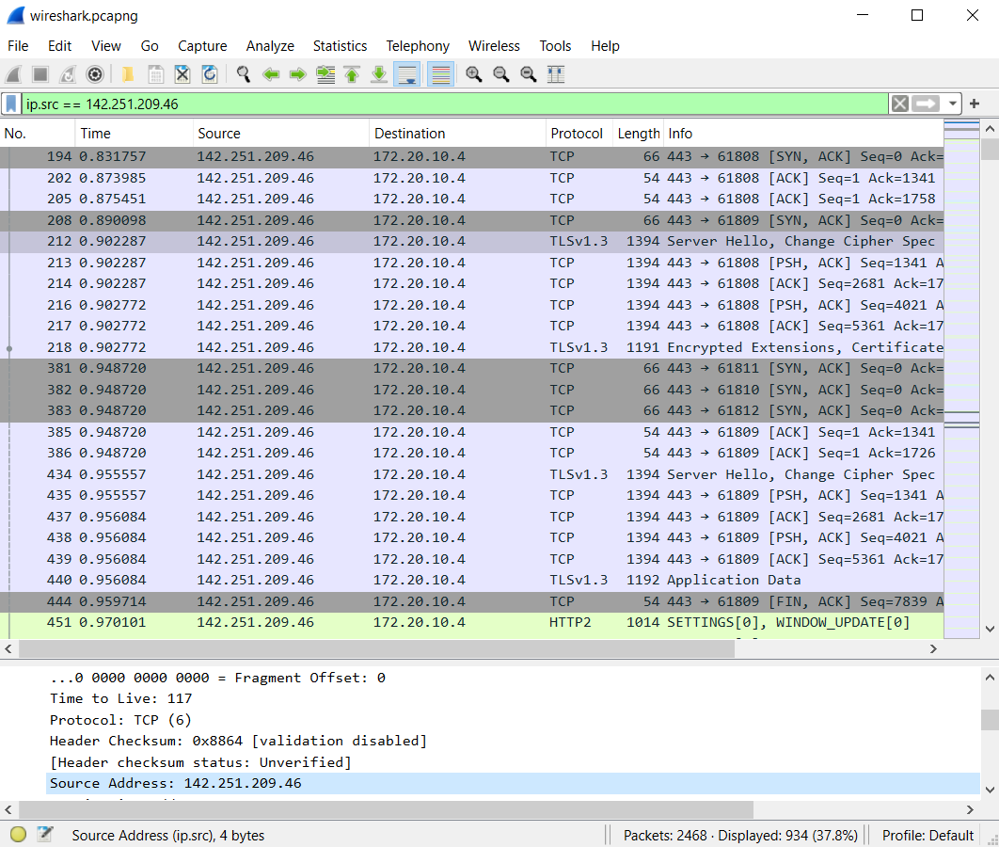
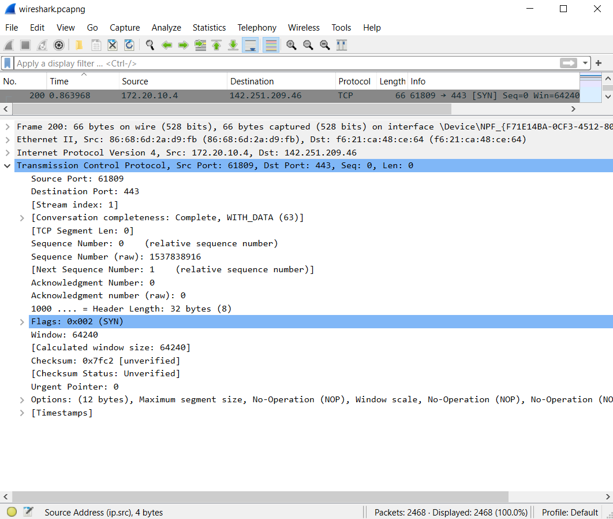
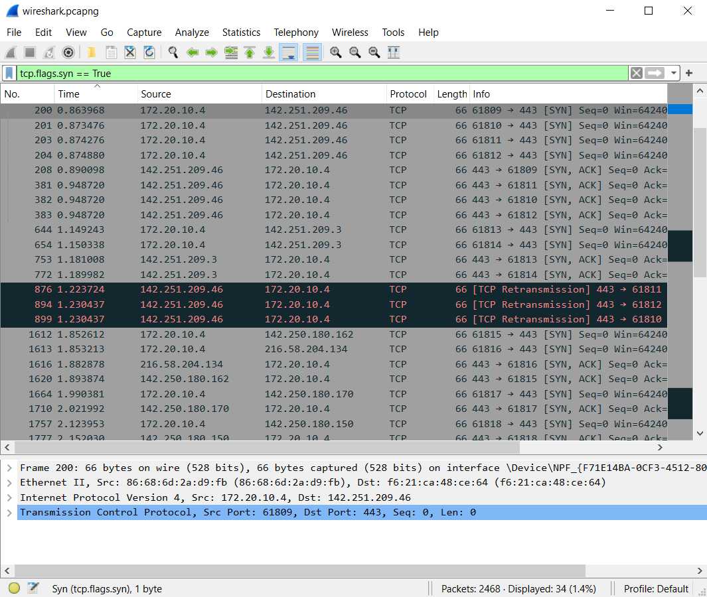

# Captures
*  `wireshark.pcapng`:
I perform a search from the browser at the address [https://wireshark.org](https://wireshark.org)

# Objectives
Learn how to read a Wireshark capture and use Display Filters.

# Packet Analysis

Let’s consider a specific record, number 212:

When you click on a record, Wireshark displays all the information contained in that record in the lower menu. This information is organized into several sections.

The first three sections are general for any record:
* Frame
* Ethernet II
* Internet Protocol Version 4

The first two sections contain information about Layer 2 of the OSI model. In the Frame section, you can also see the record number (which in this case is 212). In the Ethernet section, you can see the source and destination MAC addresses.

The third section contains information about Layer 3 of the OSI model, and you can read the source and destination IP addresses.

The subsequent sections depend on the nature of the packet and contain information about Layers 4 and above of the OSI model. In this case, there is a section called 'Transmission Control Protocol,' which refers to the TCP protocol of this record. In this section, we can see the source and destination ports.

Each section can be expanded to reveal additional information, but it also includes data that was previously shown.

# Display Filters

Display filters are used to filter the records that are displayed on the screen. They can be applied both during capture and afterward. In any case, they do not affect the records that are captured, only those that are displayed. This means that applying a display filter is always reversible.

In the bottom right corner, Wireshark always shows how many records have been captured and how many of them are currently displayed. In the previous image, no filters were applied, so we see 2468 out of 2468 (100%).

Display filters can be applied simply by typing them in the top bar. There are several types of filters.

You can filter by the protocol type of the records by simply typing the protocol name:

As shown, all the displayed records are DNS (and there are only 40 out of 2468).

**Warning**: When filtering for TCP/UDP, more than one type of protocol is displayed:

This happens because TCP and UDP are 'generic' protocols that support other protocols.

Another category of filters is based on the information contained in the packet of the record. Each piece of this information can be used as a filter.

Let’s return to record 212. Within the 'Internet Protocol Version 4' section, there is a line about the source IP:

To use this condition as a filter, you can right-click > 'Apply as Filter':

Alternatively, you can drag the line into the search bar. Or more simply, if you know the syntax, you can manually type the filter.

Of course, the same logic applies to the information contained in other sections, such as in record 200:

This is a TCP SYN record. Therefore, we can use the line in the 'TCP' section to filter all SYN records:

